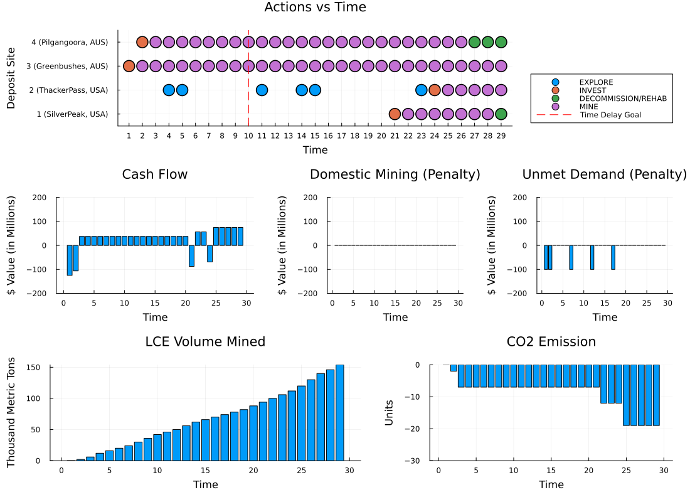
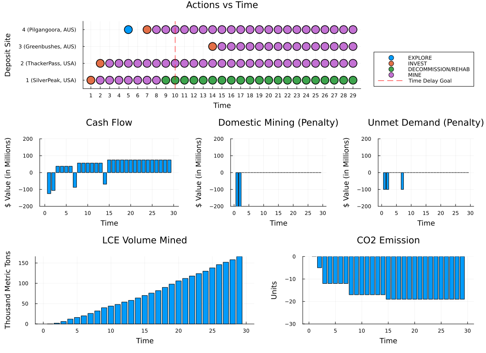
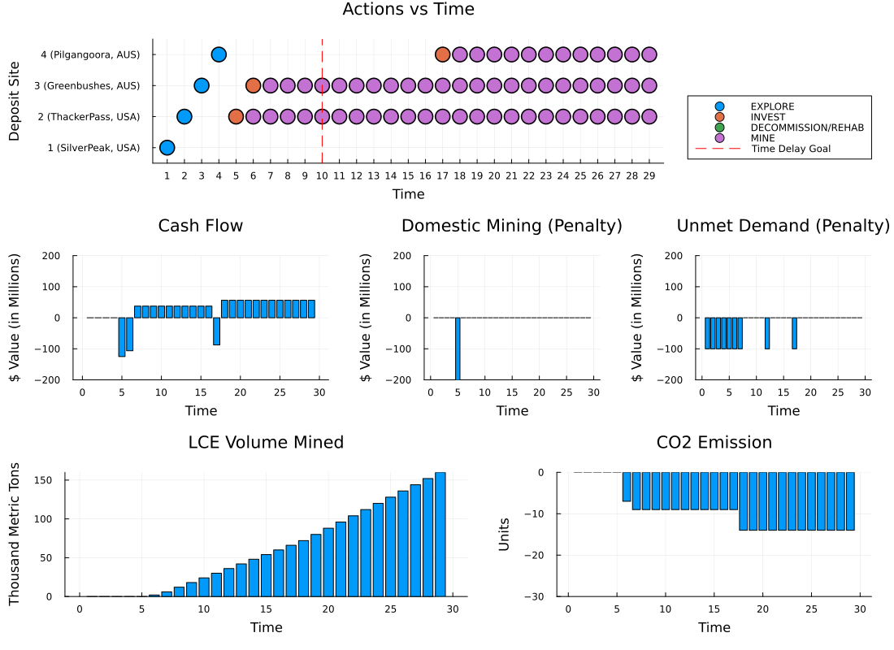

# LiPOMDPs.jl

The packaged version of the original [LiSCPOMDP](https://github.com/yalonso03/LiSCPOMDP) by [Yasmine Alonso](https://github.com/yalonso03). An example usage is as follows:

```julia
using Random
using POMDPs 
using POMDPTools
using POMDPPolicies
using LiPOMDPs
using MCTS
using DiscreteValueIteration
using POMCPOW 
using Distributions
using Parameters
using Plots
using Plots.PlotMeasures

rng = MersenneTwister(1)
pomdp = initialize_lipomdp(obj_weights=[0.25, 0.25, 1.0, 1.0, 0.25]) 
up = LiBeliefUpdater(pomdp)
b = initialize_belief(up)
mdp = GenerativeBeliefMDP(pomdp, up)
```

## POMCPOW policy

```julia
solver = POMCPOW.POMCPOWSolver(
     tree_queries=1000, estimate_value = 0, k_observation=4., 
     alpha_observation=0.06, max_depth=15, enable_action_pw=false,init_N=10  
 ) 

pomcpow_planner = solve(solver, pomdp);
hr = HistoryRecorder(rng=rng, max_steps=pomdp.time_horizon);
@time hist = simulate(hr, pomdp, pomcpow_planner, up, b);
```



## Benchmarks

### Random policy

```julia
random_planner = RandPolicy(pomdp)
@time hist = simulate(hr, pomdp, random_planner, up, b);
p = plot_results(pomdp,  get_rewards(pomdp, hist););
pall = plot(p.action, p.econ, p.other, layout=(3, 1), size=(1100, 800), margin=5mm);
savefig(pall, "figs/summary_Random_policy.png")
```



### Robust policy

```julia
robust_planner = EfficiencyPolicyWithUncertainty(pomdp, 1., [true, true, true, true])
@time hist = simulate(hr, pomdp, robust_planner, up, b);
p = plot_results(pomdp,  get_rewards(pomdp, hist););
pall = plot(p.action, p.econ, p.other, layout=(3, 1), size=(1100, 800), margin=5mm);
savefig(pall, "figs/summary_Robust_policy.png")
```



### Other policies

There are two other benchmarks included in this package: `EfficiencyPolicy` and `EmissionAwarePolicy`.

## Maintainer

Maintained by CJ Oshiro ([cjoshiro](https://github.com/cjoshiro)) and Mansur Arief ([mansurarief](https://github.com/mansurarief)).
